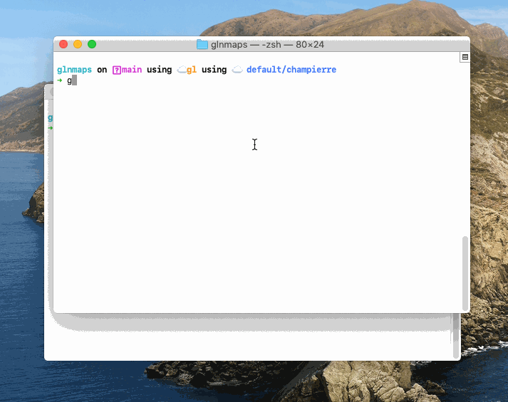
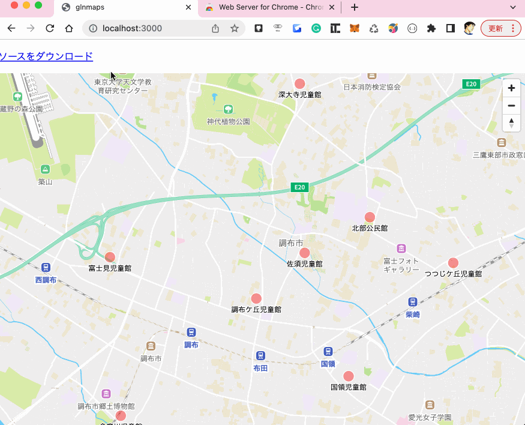

# glnmaps(**G**eo**L**o**N**ia Maps)

glnmaps(GeoLoNia Maps)は、各自治体が公開しているCSV形式のオープンデータをブラウザの地図上で確認できるツールです。
技術的な知識がなくても、誰でも簡単に使える平易なツールをめざしています。
ソースは1個のHTMLファイルとしてダウンロードできるので、それをホスティングして公開することも簡単です。

使用している[Geolonia Maps](https://docs.geolonia.com/)は、https://*.test 及び、http://127.0.0.1:<ポート番号> や http://localhost:<ポート番号> などのローカル環境で使用した場合や、GitHub Pages（https://*.github.io）上では無料で使用できるので、開発やオープンソースのプロジェクトで利用することができます。

参考: [Geolonia Mapsの開発環境での利用について](https://docs.geolonia.com/tutorial/002/#%E9%96%8B%E7%99%BA%E7%92%B0%E5%A2%83%E3%81%A7%E3%81%AE%E5%88%A9%E7%94%A8%E3%81%AB%E3%81%A4%E3%81%84%E3%81%A6)

## インストール

### 1. glnmapsのバイナリをダウンロード

[aarch64-apple-darwin](https://champierre.github.io/glnmaps/binaries/aarch64-apple-darwin-glnmaps)

```
curl -L https://champierre.github.io/glnmaps/binaries/aarch64-apple-darwin-glnmaps -o /usr/local/bin/glnmaps
```

[x86_64-apple-darwin](https://champierre.github.io/glnmaps/binaries/x86_64-apple-darwin-glnmaps)

```
curl -L https://champierre.github.io/glnmaps/binaries/x86_64-apple-darwin-glnmaps -o /usr/local/bin/glnmaps
```

[x86_64-pc-windows-msvc](https://champierre.github.io/glnmaps/binaries/x86_64-pc-windows-msvc-glnmaps.exe)

```
curl -L https://champierre.github.io/glnmaps/binaries/x86_64-pc-windows-msvc-glnmaps -o /usr/local/bin/glnmaps.exe
```

[x86_64-unknown-linux-gnu](https://champierre.github.io/glnmaps/binaries/x86_64-unknown-linux-gnu-glnmaps)

```
curl -L https://champierre.github.io/glnmaps/binaries/x86_64-unknown-linux-gnu-glnmaps -o /usr/local/bin/glnmaps
```

### 2. 実行できるようにアクセス権を変更

```
chmod a+x /usr/local/bin/glmaps
```

## 使い方

### 1. オープンデータとして公開されているCSVファイルを用意

各自治体のホームページなどで公開されているオープンデータのCSVファイルをダウンロードします。[データカタログ横断検索システム](https://search.ckan.jp/)で探すのも用意でしょう。

サンプルとして東京都調布市が公開している公共施設のデータセットを用意しておきました。

<a href="https://champierre.github.io/glnmaps/sample.csv" download>東京都 調布市 公共施設 データセット</a>

※ オープンデータを管理するには[dim](https://github.com/c-3lab/dim)を使うと便利です。サンプルの<a href="https://champierre.github.io/glnmaps/dim.json" download>dim.json</a>をダウンロードして、

```
dim install
```

と実行すれば上記サンプルを含めたデータセットを簡単に用意できます。

参考: [そろそろオープンデータを無秩序に管理するのは卒業したいので📦データを管理するパッケージマネージャを開発した【ツール開発】](https://qiita.com/ryo-ma/items/0505f7790ad2b12bcdc2)

### 2. glnmapsを使って地図に表示

```
glnmaps <CSVファイルのパス>
```

を実行するだけです。

```
glnmaps is running. Access it at: http://localhost:3000/
```

というメッセージが表示されたら、ブラウザを開き http://localhost:3000/ にアクセスしてください。



### 3. ソースをダウンロード

「ソースをダウンロード」のリンクをクリックすると、ソースのファイル(index.html)をダウンロードすることができます。

Chromeの拡張機能「[Web Server for Chrome](https://chrome.google.com/webstore/detail/web-server-for-chrome/ofhbbkphhbklhfoeikjpcbhemlocgigb)」などを使い、ローカルのWebサーバーでアクセスできるようにしたり、ホスティングサーバーに配置して公開することもできます。


